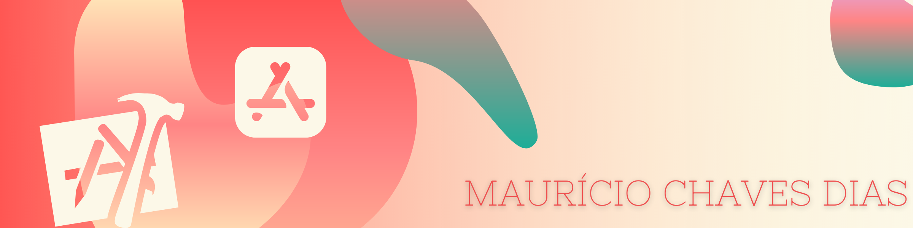

#  Tipsy
 

## Description

Split the bill adding tips with this incredible app. Now you can easily share the bill adding tips with friends much easier.

## Screenshot

## What I learned building this app

* Creation of Multi-screen apps with animated navigation.
* Use of nil coalescing operator.
* Use of Structs. 
* Pass by value vs. pass by reference. 
* Formatting Strings. 

>This is a companion project to The App Brewery's Complete App Development Bootcamp, check out the full course at [www.appbrewery.co](https://www.appbrewery.co/)

